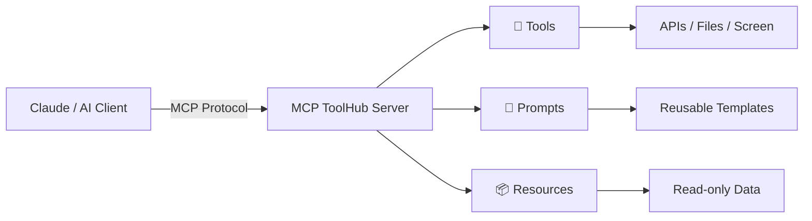

# MCP ToolHub 🚀

> A **learning-focused** [Model Context Protocol](https://modelcontextprotocol.io) server that demonstrates every core MCP concept in one place.

<div class="grid cards" markdown>

-   :material-tools:{ .lg .middle } **10 Tools**

    ---

    From a simple echo to web search, screenshot capture, crypto prices, and OpenAI vector-store memory.

    [:octicons-arrow-right-24: Explore Tools](tools/index.md)

-   :material-comment-text-multiple:{ .lg .middle } **3 Prompts**

    ---

    Reusable message templates that guide the LLM — historical reports, topic analysis, weather explanations.

    [:octicons-arrow-right-24: Explore Prompts](prompts/index.md)

-   :material-database:{ .lg .middle } **5 Resources**

    ---

    URI-addressable read-only data — inventory items, prices, and weather statements.

    [:octicons-arrow-right-24: Explore Resources](resources/index.md)

-   :material-chat-processing:{ .lg .middle } **Chat Prompt Recipes**

    ---

    Copy-paste prompts to test every feature in Claude or any MCP-compatible client.

    [:octicons-arrow-right-24: Try Recipes](prompts-library/index.md)

</div>

---

## What is MCP?

The **Model Context Protocol (MCP)** is an open standard that lets AI models interact with external tools, data sources, and services in a structured, safe way. Think of it as a USB-C port for AI — one universal interface that works across different models and clients.



---

## The Three Pillars

| Concept | What it does | Examples here |
|:--------|:-------------|:--------------|
| **Tools** | Callable functions the LLM can invoke | `echo`, `get_cryptocurrency_price`, `capture_screenshot`, `save_memory` |
| **Prompts** | Reusable message templates | `analyze_topic`, `historical_report`, `explain_weather_concept` |
| **Resources** | Read-only URI-addressable data | `inventory://overview`, `weather://{city}/statement` |

---

## Quick Install

=== "Claude Desktop"

    Add to `~/Library/Application Support/Claude/claude_desktop_config.json`:

    ```json
    {
      "mcpServers": {
        "mcp-toolhub": {
          "command": "uvx",
          "args": ["--from", "/path/to/mcp-toolhub", "mcp-toolhub"],
          "env": {
            "OPENAI_API_KEY": "sk-...",
            "WEB_SEARCH_API_KEY": "pplx-..."
          }
        }
      }
    }
    ```

=== "Local Dev (Inspector)"

    ```shell
    unset VIRTUAL_ENV
    uv run mcp dev mcpserver/myMcpServer.py
    ```

[:octicons-arrow-right-24: Full Quick Start](quickstart.md)

