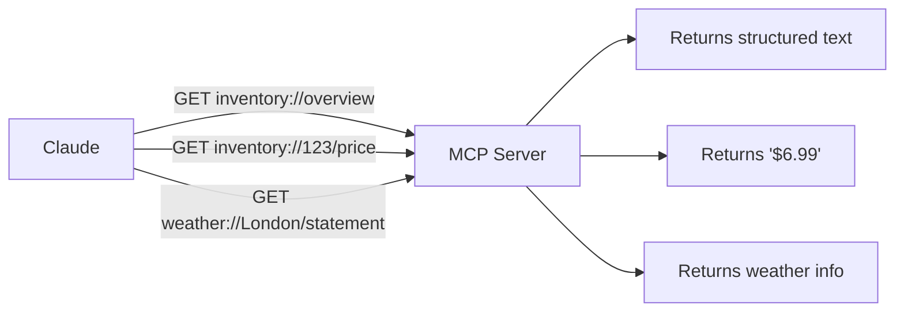

# Resources Overview

MCP **Resources** expose read-only data that the LLM can access by URI — like REST endpoints but for AI.

---

## How Resources Work



---

## Available Resources

### Inventory Resources

| URI | Description |
|:----|:------------|
| `inventory://overview` | Full list of all inventory items with IDs and prices |
| `inventory://{inventory_id}/price` | Price for a specific item by numeric ID |
| `inventory://{inventory_name}/id` | ID for a specific item by name |

**Sample data**

| ID | Name | Price |
|:---|:-----|:------|
| 123 | Coffee | $6.99 |
| 456 | Tea | $17.99 |
| 789 | Cookies | $84.99 |

### Weather Resources

| URI | Description |
|:----|:------------|
| `weather://overview` | General weather service status |
| `weather://{city}/statement` | Weather statement for a named city |

---

## Example Prompts

```
Show me the inventory overview
What is the price of item 456?
What is the ID for "Coffee"?
Get the weather overview
What's the weather statement for London?
```

!!! note "Parameterised URIs"
    Resources like `inventory://{inventory_id}/price` are **URI templates** — the `{inventory_id}` portion is filled in at request time. This is a core MCP concept for building dynamic data endpoints.

