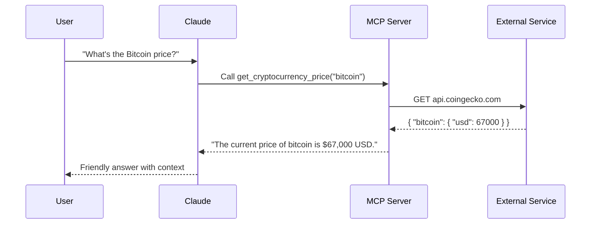

# Tools Overview

Tools are **callable functions** the LLM can invoke to take real-world actions. Each tool has a clear name, typed parameters, and a docstring description so Claude knows exactly when and how to use it.

---

## All Tools at a Glance

| Tool | Category | Description |
|:-----|:---------|:------------|
| [`factorial_safe_forLLM`](basic.md#factorial) | Basic | Returns n! with safe error handling |
| [`echo`](basic.md#echo) | Basic | Echoes back any message — great for connectivity checks |
| [`add_note`](memory-storage.md#notes) | Storage | Appends text to a local notes file |
| [`read_notes`](memory-storage.md#notes) | Storage | Reads all saved notes |
| [`get_cryptocurrency_price`](data-api.md#crypto) | API | Fetches live crypto prices via CoinGecko |
| [`perform_web_search`](data-api.md#web-search) | API | Searches the web via Perplexity/OpenAI |
| [`capture_screenshot`](screenshot.md) | Visual | Takes a screenshot and returns it as JPEG |
| [`add_person_to_member_database`](memory-storage.md#members) | Storage | Logs a structured Person record |
| [`save_memory`](memory-storage.md#vector-memory) | Memory | Saves text to an OpenAI vector store |
| [`search_memory`](memory-storage.md#vector-memory) | Memory | Semantic search over saved memories |

---

## How Tools Work

---

!!! info "Copy-paste test prompts"
    See the [💬 Chat Prompt Recipes](../prompts-library/test-all-tools.md) section for ready-made prompts to test every tool.

